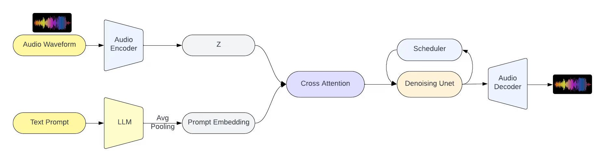

# Prompt-Audio



## Installation

```bash
sudo apt-get update
sudo apt-get upgrade
conda create -n prompt-audio python=3.12 -y
conda activate prompt-audio
conda install ffmpeg
pip install torch torchvision torchaudio pytorch-lightning datasets transformers diffusers sentencepiece librosa soundfile torcheval "lightning[extra]" xformers matplotlib torchcodec
```

## Usage

### Training

See `train.sh`.
